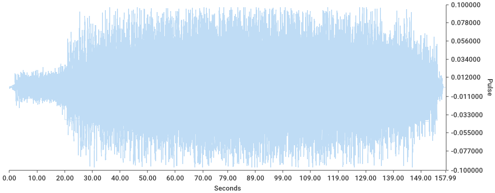

# Wavolator
Wavolator processes wav files into either CSV or a Graph, with either a complete sample set or a reduced one (such as RMS for magnitude).

Currently the highest resolution is by second.

# Usage

```
Usage:
  wavolator process graph [flags]

Flags:
  -h, --help   help for graph

Global Flags:
  -f, --filename string   [f]ilename - full path to the file you wish to process
  -d, --reducer string    re[d]ucer - to use on the dataset (default "none")
  -r, --resolution int    [r]esolution - whole int resolution for samples to be taken, in seconds (default 1)
```

Reducers implemented:
* `rms`
    * Performs a root-mean-square operation and greatly reduces the dataset to  magnitudes per resolution
* `halve`
    * Uses a `%2` to halve the dataset
* `decimate`
    * Uses a  `%10` to reduce the dataset by about 90%

# Example Output

`go run main.go process graph -f ../wavolator-old/good-idea.wav -d decimate`

